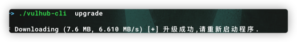

# Vulhub-CLI

> 本工具是为了方便快速选择性下载vulhub环境所诞生的小工具,从而无需下载vulhub整个仓库,只需要指定环境(app)的ID或者环境路径,即可快速将环境内容下载到本地.

## 使用帮助

```
A vulhub cli tools.

Usage:
  vulhub-cli [command]

Available Commands:
  apps        Get all supported vulnerability environment information
  cache       Download cached data file information
  deploy      Deploy vulhub files to local
  help        Help about any command
  upgrade     Online upgrade vulhub cli tools
  version     Show Version

Flags:
  -p, --configPath string    (default "$HOME/.vulhub")
  -h, --help                help for vulhub-cli
      --mirror string        (default "raw.githubusercontent.com")

Use "vulhub-cli [command] --help" for more information about a command.

```

## 命令示例

> tips: 国内网络环境不好的时候导致下载中断或者无法下载,可以试试看加上 `--mirror raw.fastgit.org again` 再次尝试(如果下载过程中中断,需要加上 `--force` 选项)

### apps

```
Get all supported vulnerability environment information,And support search.

Usage:
  vulhub-cli apps [flags]

Flags:
  -f, --filter string   Filter condition(Only support path and name filtering)
  -h, --help            help for apps

Global Flags:
  -p, --configPath string    (default "$HOME/.vulhub")
      --mirror string        (default "raw.githubusercontent.com")
```

#### 获取apps

```
./vulhub-cli apps
```


#### 过滤/搜索

```
./vulhub-cli apps -f job
```


### cache

```
./vulhub-cli cache
```


### deploy

```

Deploy vulhub files to local.

Usage:
  vulhub-cli deploy [flags]

Flags:
  -i, --appId int         App ID (default -1)
  -a, --appPath string    App Path
  -d, --destPath string   Deployment path (default "vulhub-apps")
      --force             Re-download anyway
  -h, --help              help for deploy

Global Flags:
  -p, --configPath string    (default "$HOME/.vulhub")
      --mirror string        (default "raw.githubusercontent.com")
```

#### 使用appId下载环境

```
./vulhub-cli  deploy -i 34 --force
```


#### 使用appPath下载环境

```
./vulhub-cli  deploy -a xxl-job/unacc --force --mirror raw.fastgit.org
```


### version

```
./vulhub-cli  version
```


### upgrade

```
./vulhub-cli  upgrade
```



